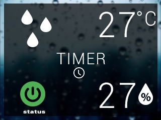

#  [Arduino](https://www.arduino.cc/) + [Nextion](http://www.itead.cc/nextion-nx3224t024.html) = Thermostatino
## [Thermostat](https://en.wikipedia.org/wiki/Thermostat) home autonomation open source
### version: 1.0  

building a [thermostat](https://en.wikipedia.org/wiki/Thermostat) spending less than $ 40, using [Arduino](https://www.arduino.cc/), and a [touch display](http://www.itead.cc/nextion-nx3224t024.html)

